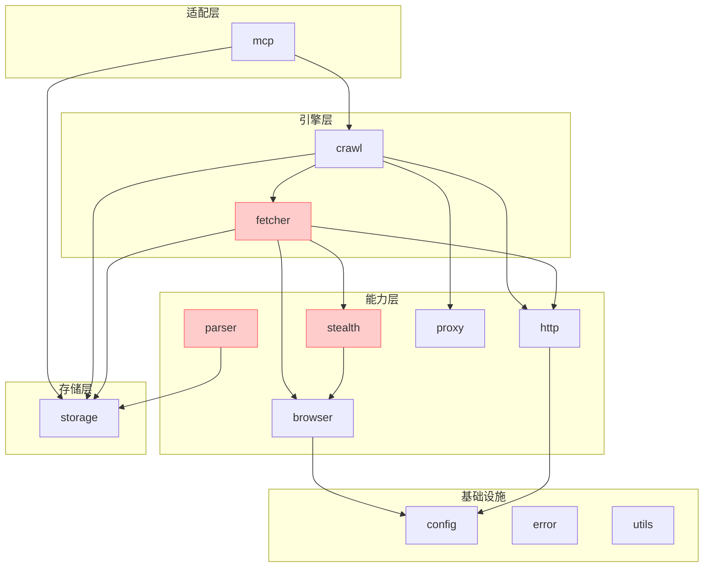
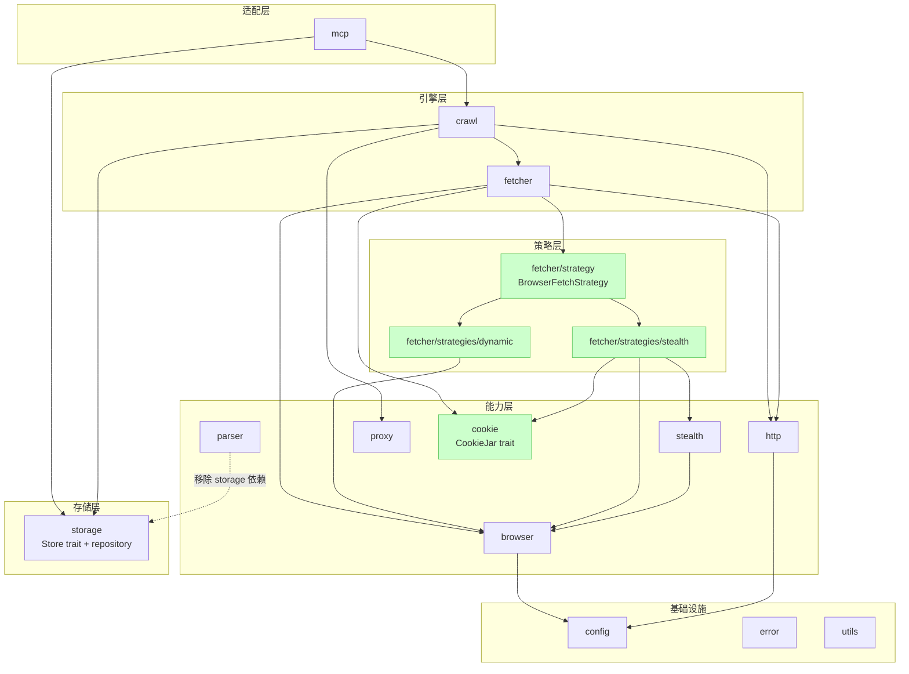

# wisp 架构审查报告

> **审查日期**：2026-07-26
> **审查范围**：wisp 框架整体架构（fetcher / crawl / browser / stealth / parser / storage / mcp）
> **审查方法**：基于源码静态分析，对照 SRP / OCP / 依赖倒置 / 失败隔离 原则

---

## 0. 上下文确认

已审阅核心文件：

- `lib.rs` / `Cargo.toml`
- `fetcher/{mod,client}.rs`
- `storage/mod.rs`
- `crawl/{mod,builder,runner,engine,middleware/mod}.rs`
- `browser/{mod,cdp,pool,launch}.rs`
- `stealth/mod.rs`
- `parser/mod.rs`
- `mcp/mod.rs`
- `proxy.rs`
- `error.rs`

无需补充上下文。

---

## 1. 架构诊断报告

### 1.1 分层架构与模块边界

| 维度 | 当前设计 | 问题/风险 | 建议方案 | 实施成本 | 兼容性影响 |
|---|---|---|---|---|---|
| FetchClient 职责聚合 | 单 struct 持有 `http::Client` + `BrowserPool` + `CfSessionCache`，`do_browser_work_inner` 直接调 `ChallengeSolver` + `HumanBehavior` + 注入 CF cookie | 反检测逻辑侵入统一入口；3 种异构资源生命周期耦合；测试难以 mock | 拆分为 `HttpFetcher` + `BrowserFetcher` + `StealthFetcher` 三个独立组件，`FetchClient` 仅持有共享资源（`Arc` 引用），具体策略通过 trait 注入 | High | 内部重构，公共 API 不变 |
| Dynamic/Stealth 模式区分 | `fetch_browser(&req, solve_cf: bool)` 用 bool 标志 | 经典 anti-pattern；无法独立演进；新增模式（如 Playwright）需修改签名 | 引入 `BrowserFetchStrategy` trait + `DynamicStrategy`/`StealthStrategy` 实现，`fetch_browser` 接收 `&dyn BrowserFetchStrategy` | Medium | 内部重构 |
| browser/stealth 边界 | `browser/patches.rs`（反检测 JS）在 browser/；`launch.rs::build_stealth_args` 命名混淆；`Browser::launch` 注释"anti-detection" | 通用 CDP 层混入反检测职责；用户想要"纯浏览器"（无 stealth）时无法剥离 | 反检测 patches 移至 `stealth/patches.rs`；`build_stealth_args` 拆为 `build_common_args` + `build_stealth_extra_args`；`Browser::launch` 移除 stealth 注释 | Low | 内部重构 |
| parser 跨层依赖 storage | `parser/adaptive.rs:8` 依赖 `storage::{ElementSnapshotRow, Store}` | 解析器非纯函数；测试需 mock Store；与"解析器独立于获取/存储层"原则冲突 | 持久化职责上移到 `crawl::adaptive::AdaptiveTracker` 组件，parser 只产出 `ElementSnapshot` 值对象 | Medium | 内部重构 |
| storage 业务 API 位置 | `save_checkpoint`/`load_response` 等自由函数与 `Store` trait 同在 `storage/mod.rs` | trait 边界与业务 API 混合；新增后端需阅读业务函数；缺少 Repository 层抽象 | 业务 API 迁移到 `storage::repository` 子模块，`mod.rs` 只暴露 trait + 类型 | Low | 内部重构 |
| mcp 反向依赖 | `mcp::serve()` 依赖 `crawl::Engine` + `storage::Store`，方向正确 | 但内部硬编码 `Engine::infra().max_pages(100_000).obey_robots(false)`，无注入 | `serve(store, engine)` 接收外部 Engine，配置由调用方决定 | Low | API 微调 |

### 1.2 抽象设计与 Trait 契约

| 维度 | 当前设计 | 问题/风险 | 建议方案 | 实施成本 | 兼容性影响 |
|---|---|---|---|---|---|
| Store trait 4 原语 | `set/get/delete/set_with_ttl` | 设计良好；但 checkpoint/element/response 三类用途通过 namespace 字符串区分，无类型安全 | 保持 4 原语不变；新增 `CheckpointStore`/`ResponseCacheStore` 等 newtype wrapper 提供类型安全 API | Low | 内部重构 |
| Spider trait vs ClosureSpider | `Spider: Send + Sync + 'static` trait object（`Arc<dyn Spider>`） | 设计合理；闭包式 `SpiderBuilder` 通过 `Handler = Arc<dyn Fn(...) -> BoxFuture>` 实现运行时多态 | 保持现状；trait object 是正确选择（见下方三维度评估） | — | — |
| FetcherBuilder 类型状态 | 单 struct，所有方法对所有模式可见（`.emulation()` 对 Stealth 无意义但可调用） | 编译期无法阻止非法配置组合；API 人体工学差 | 引入 Type State：`FetcherBuilder<Http>`/`<Dynamic>`/`<Stealth>`，模式特定方法仅对应状态可见 | Medium | API 破坏性变更 |
| 反检测策略可插拔 | ChallengeSolver + HumanBehavior + TurnstileConfig 在 FetchClient 内硬编码调用 | 新增反检测手段（如 DataDome solver）需修改 FetchClient | 抽象 `AntiDetectionStrategy` trait，通过 FetcherBuilder 注入 | Medium | 内部重构 |

### 1.3 状态管理与生命周期

| 维度 | 当前设计 | 问题/风险 | 建议方案 | 实施成本 | 兼容性影响 |
|---|---|---|---|---|---|
| Cookie 状态分散 | HTTP cookie 在 `wreq::Client`；浏览器 cookie 在 `Page`；CF cookie 在 `CfSessionCache`（FetchClient 持有） | 三处 cookie 状态无统一抽象；跨模式共享 cookie 不可能 | 引入 `CookieJar` trait，HTTP/浏览器/CF 三后端实现，Fetcher 和 Spider 共享 `Arc<dyn CookieJar>` | High | API 扩展（新增字段） |
| CdpSession 状态机 | `ConnState::{Open, Closed(String)}` + `watch::Sender` | 隐式状态机，缺少 Connecting/Ready/Closing 显式建模；状态转换散落 | 显式 enum `CdpState::{Connecting, Ready, Closing, Closed}` + 状态转换方法 | Medium | 内部重构 |
| Engine 配置参数爆炸 | `Engine` 11 字段 + `EngineConfig` 7 字段 + `EngineShared` 8 字段 | 配置散乱；新增配置需修改多处 | `Engine` 持有 `Arc<EngineConfig>`（含所有只读配置），`EngineShared` 只保留可变状态 | Low | 内部重构 |
| Browser 生命周期 | `Browser::Drop` kill 进程 + TempDir 自动清理；`BrowserPool::shutdown` | 契约清晰 ✓ | 保持现状 | — | — |

### 1.4 扩展性与开闭原则

| 维度 | 当前设计 | 问题/风险 | 建议方案 | 实施成本 | 兼容性影响 |
|---|---|---|---|---|---|
| 新增 FetchMode | 修改 `FetchMode` enum + `Fetcher::fetch` match + `FetchClient` 方法 + `default_middlewares` | 4+ 处修改，违反 OCP | 引入 `FetchStrategy` trait，`FetchMode` 变为 `enum { Http(Box<dyn FetchStrategy>), ... }` 或注册表模式 | High | API 破坏性 |
| 新增存储后端 | 实现 `Store` trait + feature gate | 设计良好 ✓；但业务层硬编码 `MemoryStore`/`FileStore` 默认值 | 保持现状 | — | — |
| 代理轮换策略 | `RotationStrategy` enum + `ProxyPool` | 新增策略需修改 enum + match（轻微违反 OCP） | 可改 `RotationStrategy` trait，但当前 3 策略足够，YAGNI | Low | — |
| 解析器 Selector trait | CSS 单一实现，无 `Selector` trait | 新增 XPath/TextSearch 需修改 Node API | 当前 XPath 未实现，YAGNI；待有 2+ 实现再抽象 | — | — |
| 回调路由标签 | `Request::callback: Option<String>` | 灵活性高，类型安全性低；typo 运行时才发现 | 保持 String；提供 `Callback` newtype 封装常见 label 常量 | Low | 内部重构 |

### 1.5 错误处理与可靠性

| 维度 | 当前设计 | 问题/风险 | 建议方案 | 实施成本 | 兼容性影响 |
|---|---|---|---|---|---|
| 错误类型分层 | 5 子枚举 + Engine + Timeout + Io，`#[from]` 转换 | 分类清晰 ✓；但 `StorageError::General(String)`、`BrowserError::Other(String)`、`McpError::General(String)` 单变体缺乏细分 | 细分 `StorageError::{NotFound, Serialization, Backend, Corrupted, Io}`；其他同理 | Low | 内部重构 |
| 失败隔离 | `buffer_unordered` + `MaxErrors` stop condition | 设计良好 ✓ | 保持现状 | — | — |
| 断点续爬 | Engine 级 per-spider name 持久化；`CrawlState.seen_urls: HashSet<u64>` | 一致性保证 ✓；但 u64 hash 调试不便 | 保持 u64（性能优先）；提供 `debug_seen_urls()` 方法返回原始 URL（需额外存储） | Low | 内部重构 |
| 超时分层 | HTTP 30s / CDP 30s / CF 30s / Browser 120s / Engine 无全局 | 层次清晰 ✓；但部分硬编码（CDP 30s、Browser 120s） | CDP/Browser 超时改为 `FetchClientConfig` 可配置字段 | Low | API 扩展 |

### 1.6 配置与构建时优化

| 维度 | 当前设计 | 问题/风险 | 建议方案 | 实施成本 | 兼容性影响 |
|---|---|---|---|---|---|
| Feature gate | 仅 `sqlite` 可选；`stealth`/`mcp`/`browser` 强制编译 | 用户只需 HTTP 抓取时承担 browser/stealth 编译成本（scraper/tokio-tungstenite/zip 等重依赖） | 新增 `stealth`/`mcp` feature gate，`default = []` 仅含 http | Medium | 公共 API 通过 feature gate 切分 |
| Builder 默认值 | `FetchClientConfig::default()` 预配置 Chromium | 资源密集型组件预配置合理 ✓ | 保持现状 | — | — |
| 静态 vs 动态配置 | TLS Profile 编译期常量；代理/超时运行时注入 | 边界清晰 ✓ | 保持现状 | — | — |
| 条件编译碎片化 | `#[cfg(feature = "sqlite")]` 散落多处 | 当前仅 1 个 feature，碎片化可控 | 引入 `storage::backend` 模块统一注册，类似 `Null Object` 模式 | Low | 内部重构 |

### 1.7 接口设计与 API 人体工学

| 维度 | 当前设计 | 问题/风险 | 建议方案 | 实施成本 | 兼容性影响 |
|---|---|---|---|---|---|
| Fetcher 链式 API | `Fetcher::http().get(url).await?` 返回统一 `Response` | 设计良好 ✓；enum 类型擦除对下游友好 | 保持现状 | — | — |
| SpiderBuilder 闭包签名 | `Fn(Response) -> BoxFuture<'static, (Vec<Value>, Vec<Request>)>` | 闭包捕获 `Arc<State>` 即可共享；无需额外注入机制 | 保持现状 | — | — |
| 流式处理 | `Spider::handle` 返回 `Vec<Value>`；`CrawlStream` 提供 items()/events() | 大量 items 内存压力大；但 Stream 增加复杂度 | 提供 `Spider::handle_stream` 默认方法返回 `BoxStream<Item = Value>`，默认包装 `handle()` 返回值 | Medium | API 扩展（新增方法） |
| MCP DTO 层 | `tools::crawl_site` 直接调用 Engine，参数直接传递 | DTO 与内部模型耦合；但当前 5 个工具耦合度低 | 引入 `mcp::dto` 模块隔离 JSON-RPC 参数，YAGNI 暂不做 | Low | — |

### 1.8 测试架构与可观测性

| 维度 | 当前设计 | 问题/风险 | 建议方案 | 实施成本 | 兼容性影响 |
|---|---|---|---|---|---|
| I/O 依赖可注入 | `FetchClient`/`BrowserPool`/`CdpSession` 是具体类型，无 trait 抽象 | 难以 mock；集成测试需真实 Chrome（`#[ignore]`） | 引入 `HttpTransport`/`CdpTransport` trait，FetchClient 接收 trait object | High | 内部重构 |
| 并发测试 | `tokio::test` + `MockStore`（storage/mod.rs 内置） | 测试良好 ✓；但缺少 `MockClock`/`MockStream` 时序验证 | 保持现状 | — | — |
| Metrics 扩展点 | `SpiderStats` 自定义原子计数器；`CrawlEvent` 事件流 | 无 prometheus/opentelemetry 对接；用户无法导出 metrics | 引入 `MetricsCollector` trait，Engine 持有 `Option<Arc<dyn MetricsCollector>>` | Medium | API 扩展 |

---

## 2. Trait 对象 vs 泛型 — 三维度评估

| Trait | 当前选择 | 编译时间 | 运行时开销 | API 人体工学 | 结论 |
|---|---|---|---|---|---|
| `Spider` | `Arc<dyn Spider>` | 快（单态化少） | 虚调用（可忽略） | 好（运行时多态，多 Spider 共享 Engine） | **保持 trait object**。Spider 实现多样（ClosureSpider + 用户自定义），泛型会导致 `Engine<S>` 泛型爆炸 |
| `Store` | `Arc<dyn Store>` | 快 | 虚调用（可忽略） | 好（后端可插拔） | **保持 trait object**。存储后端运行时决定（配置文件/feature gate） |
| `Middleware` | `Arc<dyn Middleware>` | 快 | 虚调用（每个请求 N 次） | 好（链式组合） | **保持 trait object**。中间件数量运行时决定 |
| `Handler` | `Arc<dyn Fn(...) -> BoxFuture>` | 快 | 双重虚调用（Fn + BoxFuture） | 好（闭包类型不可名状） | **保持 trait object**。泛型无法表达闭包多样性 |
| `Fetcher` | enum + match | 快 | 无虚调用 | 中（扩展性差） | **保持 enum**。模式编译期已知（4 种），性能敏感，trait object 收益低于扩展成本 |

**关键洞察**：wisp 的 trait object 选择都正确。唯一可优化的是 `Fetcher` 的 enum 模式扩展性差，但引入 trait object 会破坏 `Fetcher::http()` 的 ergonomic API。**建议保持现状**，通过 `BrowserFetchStrategy` trait 解决 `fetch_browser` 的 bool 标志问题，而非改造 Fetcher 本身。

---

## 3. 核心架构代码片段

针对 High/Medium 重构项，提供核心定义。仅包含 Trait / Enum / Struct 定义及关键函数签名，不含具体实现。

### 3.1 拆分 FetchClient 职责（High）

```rust
// fetcher/strategy.rs
use crate::error::Result;
use crate::browser::Page;
use super::response::{Request, Response};

/// 浏览器抓取策略 — 区分 Dynamic/Stealth 的差异化逻辑。
///
/// ARCH: 替代 `fetch_browser(&req, solve_cf: bool)` 的 bool 标志，
/// 使新策略（如 Playwright）可零侵入注入。
#[async_trait::async_trait]
pub trait BrowserFetchStrategy: Send + Sync {
    /// 执行浏览器导航 + 后处理（CF 挑战 / 人类行为 / 等待选择器等）。
    async fn fetch(&self, page: &mut Page, req: &Request) -> Result<Response>;

    /// 是否需要在导航前注入 cookie（如 CF 复用）。
    fn needs_cookie_injection(&self) -> bool { false }
}

// fetcher/strategies/dynamic.rs
pub struct DynamicStrategy {
    pub wait_for: Option<String>,
    pub extra_wait_ms: u64,
}

#[async_trait::async_trait]
impl BrowserFetchStrategy for DynamicStrategy {
    async fn fetch(&self, page: &mut Page, req: &Request) -> Result<Response> {
        page.goto(&req.url).await?;
        if let Some(sel) = &self.wait_for {
            page.wait_for_selector(sel, Duration::from_millis(self.extra_wait_ms.max(1000))).await?;
        }
        // 提取 Response...
    }
}

// fetcher/strategies/stealth.rs
pub struct StealthStrategy {
    pub challenge_timeout: Duration,
    pub turnstile: TurnstileConfig,
    pub human_mode: bool,
    pub cf_cache: Arc<CfSessionCache>,  // ARCH: CF cookie 移至 stealth 策略内部
}

#[async_trait::async_trait]
impl BrowserFetchStrategy for StealthStrategy {
    async fn fetch(&self, page: &mut Page, req: &Request) -> Result<Response> {
        // 注入 CF cookie + 导航 + ChallengeSolver + HumanBehavior
        // ...
    }
    fn needs_cookie_injection(&self) -> bool { true }
}

// fetcher/client.rs
pub struct FetchClient {
    http: Arc<Client>,
    browser_pool: Option<Arc<BrowserPool>>,
    config: FetchClientConfig,
    // ARCH: 删除 cf_cache 字段，移入 StealthStrategy
    strategies: FetchStrategies,  // 持有 Http/Dynamic/Stealth 三策略
}

impl FetchClient {
    pub async fn fetch_browser(
        &self,
        req: &Request,
        strategy: &dyn BrowserFetchStrategy,
    ) -> Result<Response> {
        let mut handle = self.browser_pool.as_ref()
            .ok_or_else(|| /* ... */)?.acquire().await?;
        let work = strategy.fetch(handle.page_mut(), req);
        let result = tokio::time::timeout(Duration::from_secs(120), work).await
            .map_err(|_| WispError::Timeout(/* ... */))??;
        let _ = handle.page_mut().close().await;
        Ok(result)
    }
}
```

### 3.2 CookieJar 统一抽象（High）

```rust
// cookie.rs
use std::sync::Arc;
use url::Url;

/// Cookie 存储 trait — 统一 HTTP/浏览器/CF 三处 cookie 状态。
///
/// ARCH: 解决 cookie 状态分散问题，Fetcher 和 Spider 共享同一 CookieJar。
pub trait CookieJar: Send + Sync {
    /// 获取指定 URL 的所有匹配 cookie。
    fn get(&self, url: &Url) -> Vec<Cookie>;

    /// 写入 cookie。
    fn set(&self, cookie: Cookie);

    /// 获取 Cookie 头字符串（用于 HTTP 请求）。
    fn header(&self, url: &Url) -> Option<String> {
        let cookies = self.get(url);
        if cookies.is_empty() { return None; }
        Some(cookies.iter()
            .map(|c| format!("{}={}", c.name, c.value))
            .collect::<Vec<_>>().join("; "))
    }
}

/// HTTP cookie jar（基于 wreq::Client 的 cookie_store）。
pub struct HttpCookieJar { /* ... */ }

/// 浏览器 cookie jar（通过 CDP Network.getCookies）。
pub struct BrowserCookieJar { /* session: Arc<CdpSession> */ }

/// CF 会话 cookie jar（基于 moka::Cache + 文件持久化）。
pub struct CfCookieJar { /* mem: Cache<String, CfSession>, file: PathBuf */ }
```

### 3.3 Engine 配置聚合（Low）

```rust
// crawl/runner.rs
pub struct Engine {
    fetch_client: Arc<FetchClient>,
    // ARCH: 配置聚合到 EngineConfig，Engine 只持有 Arc<EngineConfig>
    config: Arc<EngineConfig>,
    cache_store: Option<Arc<dyn Store>>,
    checkpoint_store: Option<Arc<dyn Store>>,
    control: Arc<control::EngineControl>,
    autoscale: Option<Arc<AutoscaledPool>>,
    running: Arc<AtomicBool>,
}

/// 所有只读引擎配置聚合。
pub struct EngineConfig {
    pub max_concurrent: usize,
    pub max_pages: usize,
    pub max_refetch_rounds: usize,
    pub checkpoint_interval: usize,
    pub fetch_mode: FetchMode,
    pub obey_robots: bool,
    pub max_retries: u32,
    pub download_delay: Duration,
    pub auto_rules: Vec<(String, FetchMode)>,
}
```

### 3.4 MetricsCollector 扩展点（Medium）

```rust
// crawl/observability/metrics.rs
use std::sync::Arc;

/// Metrics 收集器 trait — 对接 prometheus/opentelemetry。
///
/// ARCH: 默认 NullMetricsCollector 无操作，用户可注入自定义实现。
pub trait MetricsCollector: Send + Sync {
    fn record_request(&self, url: &str, status: u16, duration: Duration);
    fn record_error(&self, url: &str, error: &str);
    fn record_retry(&self, url: &str, attempt: u32);
    fn record_item(&self, spider: &str);
    fn record_page(&self, spider: &str);
}

pub struct NullMetricsCollector;
impl MetricsCollector for NullMetricsCollector {
    fn record_request(&self, _: &str, _: u16, _: Duration) {}
    fn record_error(&self, _: &str, _: &str) {}
    fn record_retry(&self, _: &str, _: u32) {}
    fn record_item(&self, _: &str) {}
    fn record_page(&self, _: &str) {}
}

// EngineBuilder
pub fn metrics(mut self, collector: Arc<dyn MetricsCollector>) -> Self {
    self.metrics = Some(collector);
    self
}
```

### 3.5 StorageError 细分（Low）

```rust
// error.rs
#[derive(Debug, Error)]
pub enum StorageError {
    #[error("Storage error: {0}")]
    General(String),

    #[error("Key not found in namespace {namespace}: {key}")]
    NotFound { namespace: String, key: String },

    #[error("Serialization failed: {0}")]
    Serialization(String),

    #[error("Backend error: {0}")]
    Backend(String),

    #[error("Data corrupted: {0}")]
    Corrupted(String),

    #[error("IO error: {0}")]
    Io(#[from] std::io::Error),
}
```

### 3.6 FetcherBuilder Type State（Medium，可选）

```rust
// fetcher/builder.rs
use std::marker::PhantomData;

/// 模式标记 trait — 编译期约束配置组合。
pub trait FetchModeState: private::Sealed {}

pub struct HttpMode;
pub struct DynamicMode;
pub struct StealthMode;

impl FetchModeState for HttpMode {}
impl FetchModeState for DynamicMode {}
impl FetchModeState for StealthMode {}

mod private {
    pub trait Sealed {}
    impl Sealed for super::HttpMode {}
    impl Sealed for super::DynamicMode {}
    impl Sealed for super::StealthMode {}
}

pub struct FetcherBuilder<M: FetchModeState> {
    config: FetchClientConfig,
    _mode: PhantomData<M>,
}

impl FetcherBuilder<HttpMode> {
    pub fn emulation(mut self, p: Profile) -> Self { self.config.emulation = Some(p); self }
    pub fn no_emulation(mut self) -> Self { self.config.emulation = None; self }
    // ARCH: 不暴露 headless()/human_mode()/challenge_timeout() 等浏览器选项
}

impl FetcherBuilder<StealthMode> {
    pub fn headless(mut self, v: bool) -> Self { self.config.headless = v; self }
    pub fn human_mode(mut self, v: bool) -> Self { self.config.human_mode = v; self }
    pub fn challenge_timeout(mut self, d: Duration) -> Self { self.config.challenge_timeout = d; self }
    pub fn turnstile_config(mut self, cfg: TurnstileConfig) -> Self { self.config.turnstile = cfg; self }
}

impl FetcherBuilder<DynamicMode> {
    pub fn headless(mut self, v: bool) -> Self { self.config.headless = v; self }
    pub fn wait_for(mut self, selector: &str) -> Self { self.config.wait_for = Some(selector.into()); self }
}

// 通用方法对所有模式可用
impl<M: FetchModeState> FetcherBuilder<M> {
    pub fn proxy(mut self, url: &str) -> Self { self.config.proxy = Some(url.into()); self }
    pub fn timeout(mut self, d: Duration) -> Self { self.config.timeout = d; self }
    pub fn user_agent(mut self, ua: &str) -> Self { self.config.user_agent = Some(ua.into()); self }
    pub fn header(mut self, k: &str, v: &str) -> Self { self.config.headers.insert(k.into(), v.into()); self }
    pub fn build(self) -> Result<Fetcher> { /* ... */ }
}
```

---

## 4. 模块依赖关系图

### 4.1 重构前（当前）



**问题高亮**：

- `fetcher` 依赖 `stealth`（反检测职责侵入统一入口）
- `parser` 依赖 `storage`（解析器非纯函数）
- `fetcher` 内部混合 HTTP + 浏览器 + CF 缓存三种异构资源

### 4.2 重构后（建议）



**关键变化**：

1. **`fetcher` 不再直接依赖 `stealth`**：通过 `BrowserFetchStrategy` trait 解耦，StealthStrategy 在 `fetcher/strategies/stealth` 中组合 stealth 模块
2. **`parser` 移除对 `storage` 的依赖**：adaptive 持久化上移到 `crawl::adaptive::AdaptiveTracker`
3. **新增 `cookie` 模块**：统一 HTTP/浏览器/CF 三处 cookie 状态
4. **`stealth` 重新成为纯反检测模块**：CF cookie 缓存移至 `fetcher/strategies/stealth`

---

## 5. 优先级排序与实施建议

| 优先级 | 重构项 | 实施成本 | 兼容性影响 | 建议时机 |
|---|---|---|---|---|
| P0 | 拆分 FetchClient 职责（BrowserFetchStrategy） | High | 内部 | 下次大版本 |
| P0 | CookieJar 统一抽象 | High | API 扩展 | 下次大版本 |
| P1 | parser 移除 storage 依赖 | Medium | 内部 | 独立 PR |
| P1 | browser/stealth 边界清理（patches 迁移） | Low | 内部 | 独立 PR |
| P1 | Feature gate（stealth/mcp 可选） | Medium | API 切分 | 下次大版本 |
| P2 | FetcherBuilder Type State | Medium | API 破坏 | 下次大版本 |
| P2 | MetricsCollector 扩展点 | Medium | API 扩展 | 按需 |
| P2 | I/O trait 抽象（可测试性） | High | 内部 | 按需 |
| P3 | Engine 配置聚合 | Low | 内部 | 独立 PR |
| P3 | StorageError 细分 | Low | 内部 | 独立 PR |
| P3 | CdpSession 显式状态机 | Medium | 内部 | 按需 |

---

## 6. 总结

wisp 整体架构**良好**：分层清晰、trait 设计合理、错误分类完整、中间件链符合 Scrapy 范式。ND-031-ARCH（Spider 配置迁移到 EngineBuilder）和性能优化阶段已解决主要架构问题。

### 核心待改进项

1. **FetchClient 职责聚合**（最严重）：反检测逻辑侵入统一入口，需通过 `BrowserFetchStrategy` trait 拆分
2. **Cookie 状态分散**：三处独立 cookie 存储，缺少 `CookieJar` 统一抽象
3. **Parser 跨层依赖**：解析器非纯函数，持久化职责应上移

### 保持现状的部分

- trait object 选择（Spider / Store / Middleware / Handler）
- Store 4 原语
- 错误分类（5 子枚举 + Engine + Timeout + Io）
- Builder 模式
- Engine 流驱动架构（`stream::unfold` + `buffer_unordered`）

遵循"渐进式复杂"原则，建议按 P0 → P1 → P2 → P3 顺序重构，每次重构保持测试全绿（当前 273 测试）。
