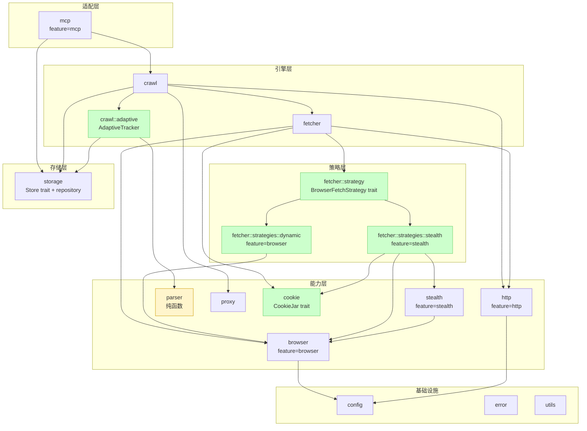
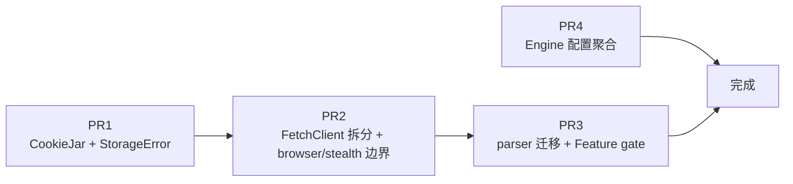

# wisp 架构重构设计

**日期**: 2026-07-26
**状态**: 待审核
**前置文档**: [架构审查报告](../../architecture-review-2026-07-26.md)

## 1. 概述

### 1.1 范围

基于架构审查报告，对 wisp 框架进行 7 项重构，分 4 个 PR 按依赖顺序实施：

| PR | 内容 | 依赖 | 成本 |
|---|---|---|---|
| PR1 | CookieJar trait + 三实现 + StorageError 细分 | 无 | High + Low |
| PR2 | FetchClient 拆分（BrowserFetchStrategy）+ browser/stealth 边界清理 | PR1 | High + Low |
| PR3 | parser adaptive 迁到 crawl::adaptive + Feature gate 分层 | PR2 | Medium + Medium |
| PR4 | Engine 配置聚合（Arc<EngineConfig>） | 独立（可与 PR2/PR3 并行） | Low |

### 1.2 目标

1. **FetchClient 职责单一化**：反检测逻辑从统一入口下沉到 strategy 实现
2. **Cookie 状态统一**：HTTP/浏览器/CF 三处 cookie 收敛到 CookieJar trait
3. **Parser 纯函数化**：消除 parser 对 storage 的依赖
4. **Feature gate 分层**：HTTP-only 用户不承担 browser/stealth 编译成本
5. **Engine 配置聚合**：26 个散落字段收敛到 Arc<EngineConfig>

### 1.3 关键决策

| 决策项 | 选择 | 理由 |
|---|---|---|
| CookieJar 范围 | 完整统一三种 cookie | 跨模式共享 cookie，彻底解决状态分散 |
| FetchClient 拆分粒度 | 接收 `&dyn BrowserFetchStrategy` 参数 | 公共 API 不变，FetchClient 不依赖 stealth |
| Feature gate 粒度 | 分层（http/browser/stealth/mcp/sqlite） | 用户按需启用，减少编译成本 |
| parser adaptive 迁移 | 迁到 `crawl::adaptive::AdaptiveTracker` | parser 纯函数，持久化上移 |
| API 兼容性 | 不保证 | 遵循项目"从不向后兼容"约束 |
| Spec 组织 | 单个 spec + 分阶段 plan | 4 个 PR 是连贯架构演进，统一 spec 保证一致性 |

## 2. 重构后模块依赖图



### 关键变化

1. **`fetcher` 不再依赖 `stealth`**：通过 `BrowserFetchStrategy` trait 解耦
2. **`parser` 完全独立**：移除对 storage 的依赖，adaptive 持久化上移到 `crawl::adaptive`
3. **新增 `cookie` 模块**：统一三种 cookie 状态
4. **Feature gate 分层**：HTTP-only 用户不编译 browser/stealth

## 3. PR1: CookieJar + StorageError

### 3.1 CookieJar trait

```rust
// cookie.rs
use url::Url;
use std::sync::Arc;
use serde::{Serialize, Deserialize};
use async_trait::async_trait;

/// Cookie 表示（统一格式，跨 HTTP/浏览器/CF）。
#[derive(Debug, Clone, Serialize, Deserialize)]
pub struct Cookie {
    pub name: String,
    pub value: String,
    pub domain: String,
    pub path: String,
    pub secure: bool,
    pub http_only: bool,
    pub same_site: Option<String>,
    pub expires: Option<f64>,
}

/// Cookie 存储 trait — 统一 HTTP/浏览器/CF 三处 cookie 状态。
///
/// ARCH: 解决 cookie 状态分散问题。FetchClient 持有 `Arc<dyn CookieJar>`，
/// strategy 可访问。三种实现：
/// - HttpCookieJar: 包装 wreq::Client 的 cookie_store
/// - BrowserCookieJar: 通过 CDP Network.getCookies/setCookie
/// - CfCookieJar: moka::Cache + 文件持久化（从 FetchClient 迁出）
#[async_trait]
pub trait CookieJar: Send + Sync {
    /// 获取指定 URL 的所有匹配 cookie（按 domain/path/secure 匹配）。
    async fn get(&self, url: &Url) -> Vec<Cookie>;

    /// 写入 cookie。
    async fn set(&self, cookie: Cookie);

    /// 删除指定 URL 匹配的所有 cookie（用于失效会话）。
    async fn clear(&self, url: &Url);

    /// 获取 Cookie 头字符串（用于 HTTP 请求注入）。
    /// 默认实现基于 `get()`，可被覆盖以优化。
    async fn header(&self, url: &Url) -> Option<String> {
        let cookies = self.get(url).await;
        if cookies.is_empty() {
            return None;
        }
        Some(
            cookies
                .iter()
                .map(|c| format!("{}={}", c.name, c.value))
                .collect::<Vec<_>>()
                .join("; "),
        )
    }
}
```

### 3.2 三种实现

```rust
/// HTTP cookie jar（包装 wreq::Client 的 cookie_store）。
///
/// ARCH: FetchClient 构建 wreq::Client 时启用 cookies feature，
/// HttpCookieJar 通过 wreq::Client 的 cookie_store API 读写。
/// 若 wreq 不暴露公开 API，则改用 `cookie_store` crate 独立实现
/// （实施时验证 wreq 6.0.0-rc.29 的 cookie_store 可访问性）。
pub struct HttpCookieJar {
    client: Arc<crate::http::Client>,
}

/// 浏览器 cookie jar（通过 CDP Network.getCookies/setCookie）。
///
/// ARCH: 每个 Page 持有一个 BrowserCookieJar，导航后可读取 cookie，
/// ChallengeSolver 解决 CF 后将 cookie 写入此 jar。
pub struct BrowserCookieJar {
    session: Arc<crate::browser::CdpSession>,
    session_id: Option<String>,
}

/// CF 会话 cookie jar（moka::Cache + 文件持久化）。
///
/// ARCH: 从 FetchClient 迁出，由 StealthStrategy 持有。
/// 保留两级缓存（moka 内存 + JSON 文件），TTL 默认 30 分钟。
pub struct CfCookieJar {
    mem: moka::sync::Cache<String, CfSession>,
    file_path: PathBuf,
}
```

### 3.3 FetchClient 集成

```rust
// fetcher/client.rs
pub struct FetchClient {
    http: Arc<Client>,
    browser_pool: Option<Arc<BrowserPool>>,
    config: FetchClientConfig,
    // ARCH: 删除 cf_cache 字段，移入 StealthStrategy
    // ARCH: 新增 cookie_jar，供所有 strategy 共享
    cookie_jar: Arc<dyn CookieJar>,
}

impl FetchClient {
    pub fn new(config: FetchClientConfig) -> Result<Self> {
        let http = Arc::new(Self::build_http_client(&config)?);
        let browser_pool = Self::build_browser_pool(&config);
        // ARCH: 默认使用 HttpCookieJar（包装 http::Client）
        let cookie_jar: Arc<dyn CookieJar> = Arc::new(HttpCookieJar::new(Arc::clone(&http)));
        Ok(Self { http, browser_pool, config, cookie_jar })
    }

    /// 获取共享 CookieJar。
    pub fn cookie_jar(&self) -> &Arc<dyn CookieJar> {
        &self.cookie_jar
    }
}
```

### 3.4 StorageError 细分

```rust
// error.rs
#[derive(Debug, Error)]
pub enum StorageError {
    /// 通用存储错误（保留向后兼容，新代码应使用具体变体）。
    #[error("Storage error: {0}")]
    General(String),

    /// 键不存在（namespace + key 定位）。
    #[error("Key not found in namespace {namespace}: {key}")]
    NotFound { namespace: String, key: String },

    /// 序列化/反序列化失败。
    #[error("Serialization failed: {0}")]
    Serialization(String),

    /// 后端错误（SQLite/文件系统等底层错误）。
    #[error("Backend error: {0}")]
    Backend(String),

    /// 数据损坏（存储的内容无法解析）。
    #[error("Data corrupted: {0}")]
    Corrupted(String),

    /// IO 错误。
    #[error("IO error: {0}")]
    Io(#[from] std::io::Error),
}
```

### 3.5 迁移点

| 位置 | 变更 |
|---|---|
| `fetcher/client.rs` | 删除 `CfSessionCache` 字段和相关方法（`has_cf_cookies`/`get_cf_cookie_header`/`get_cf_ua`） |
| `fetcher/client.rs` | 新增 `cookie_jar: Arc<dyn CookieJar>` 字段 |
| `stealth/challenge.rs` | ChallengeSolver 解决后写入 `cookie_jar`（而非 cf_cache） |
| `fetcher/client.rs::do_browser_work_inner` | CF cookie 注入逻辑移到 StealthStrategy（PR2） |
| `storage/mod.rs` | `load_element` 等解析错误改用 `StorageError::Corrupted` 而非 `General` |
| `error.rs` | 新增 4 个 StorageError 变体 |

### 3.6 测试策略

- **CookieJar trait 单元测试**：MockCookieJar 实现，验证 `get/set/clear/header` 语义
- **HttpCookieJar 集成测试**：实际 HTTP 请求验证 cookie 自动管理
- **CfCookieJar 单元测试**：TTL 过期、文件持久化往返
- **StorageError 测试**：各变体的 `Display` 输出、`#[from]` 转换
- 保持现有测试全绿

### 3.7 风险与缓解

| 风险 | 缓解 |
|---|---|
| wreq 6.0.0-rc.29 的 cookie_store API 不公开 | 实施时先验证；若不公开，改用 `cookie_store` crate（增加 1 个依赖） |
| HttpCookieJar 替换 wreq 自动 cookie 管理可能丢失重定向 cookie | 保留 wreq cookies feature 启用，HttpCookieJar 只读取不替换 |
| BrowserCookieJar 的 CDP 调用是 async，trait 也需 async | 用 `async_trait`，HTTP/CF 实现内部同步代码包装为 async |

## 4. PR2: FetchClient 拆分 + browser/stealth 边界清理

### 4.1 BrowserFetchStrategy trait

```rust
// fetcher/strategy.rs
use async_trait::async_trait;
use crate::browser::Page;
use crate::error::Result;
use super::response::{Request, Response};

/// 浏览器抓取策略 — 区分 Dynamic/Stealth 的差异化逻辑。
///
/// ARCH: 替代 `fetch_browser(&req, solve_cf: bool)` 的 bool 标志。
/// 新策略（如 Playwright）可实现此 trait 零侵入注入。
#[async_trait]
pub trait BrowserFetchStrategy: Send + Sync {
    /// 执行浏览器导航 + 后处理（CF 挑战 / 人类行为 / 等待选择器等）。
    ///
    /// 调用方保证：调用前已 `acquire` page，调用后由调用方 `close` page。
    async fn fetch(&self, page: &mut Page, req: &Request) -> Result<Response>;
}
```

### 4.2 两种策略实现

```rust
// fetcher/strategies/dynamic.rs
use std::time::Duration;
use crate::browser::Page;
use crate::error::Result;
use crate::fetcher::response::{Request, Response};
use crate::fetcher::strategy::BrowserFetchStrategy;

/// Dynamic 模式策略：浏览器渲染 + JS 执行，无 CF 绕过。
pub struct DynamicStrategy {
    wait_for: Option<String>,
    extra_wait_ms: u64,
}

impl DynamicStrategy {
    /// 从 FetchClientConfig 构造。
    pub fn from_config(config: &crate::fetcher::FetchClientConfig) -> Self {
        Self {
            wait_for: config.wait_for.clone(),
            extra_wait_ms: config.extra_wait_ms,
        }
    }
}

#[async_trait::async_trait]
impl BrowserFetchStrategy for DynamicStrategy {
    async fn fetch(&self, page: &mut Page, req: &Request) -> Result<Response> {
        // ARCH: 从 do_browser_work_inner 提取的通用逻辑
        // 1. Network.enable
        // 2. subscribe_events
        // 3. page.goto
        // 4. recv_navigation_status
        // 5. wait_for_selector（如有）
        // 6. 提取 Response（status + body + headers）
    }
}
```

```rust
// fetcher/strategies/stealth.rs
use std::sync::Arc;
use std::time::Duration;
use crate::browser::Page;
use crate::cookie::CfCookieJar;
use crate::error::Result;
use crate::fetcher::response::{Request, Response};
use crate::fetcher::strategy::BrowserFetchStrategy;
use crate::stealth::{ChallengeSolver, HumanBehavior, TurnstileConfig};

/// Stealth 模式策略：CF bypass + 人类行为模拟 + cookie 复用。
///
/// ARCH: CfCookieJar 从 FetchClient 迁入此策略，由 StealthStrategy 独占持有。
pub struct StealthStrategy {
    challenge_timeout: Duration,
    turnstile: TurnstileConfig,
    human_mode: bool,
    /// CF 会话 cookie 缓存（moka + 文件持久化）。
    cf_jar: Arc<CfCookieJar>,
}

impl StealthStrategy {
    /// 从 FetchClientConfig + 共享 CfCookieJar 构造。
    pub fn from_config(
        config: &crate::fetcher::FetchClientConfig,
        cf_jar: Arc<CfCookieJar>,
    ) -> Self {
        Self {
            challenge_timeout: config.challenge_timeout,
            turnstile: config.turnstile.clone(),
            human_mode: config.human_mode,
            cf_jar,
        }
    }
}

#[async_trait::async_trait]
impl BrowserFetchStrategy for StealthStrategy {
    async fn fetch(&self, page: &mut Page, req: &Request) -> Result<Response> {
        // ARCH: 从 do_browser_work_inner 提取的 stealth 逻辑
        // 1. Network.enable + subscribe_events
        // 2. 注入 CF cookie（从 cf_jar 读取，写入 page）
        // 3. page.goto
        // 4. recv_navigation_status
        // 5. ChallengeSolver::solve_with_config（challenge_timeout, turnstile）
        // 6. nav_status = 200（CF 挑战解决后修正）
        // 7. HumanBehavior（if human_mode）
        // 8. 保存 cookie 到 cf_jar（从 page 读取，domain 索引）
        // 9. 提取 Response
    }
}
```

### 4.3 FetchClient 新签名

```rust
// fetcher/client.rs
impl FetchClient {
    /// 浏览器请求（通过 BrowserPool + 注入 strategy）。
    ///
    /// ARCH: 替代 `fetch_browser(&req, solve_cf: bool)`。
    /// strategy 由调用方传入，FetchClient 不再关心 CF/ Dynamic 差异。
    pub async fn fetch_browser(
        &self,
        req: &Request,
        strategy: &dyn BrowserFetchStrategy,
    ) -> Result<Response> {
        let pool = self.browser_pool.as_ref().ok_or_else(|| {
            WispError::Browser(BrowserError::Other(
                "browser pool not configured (max_concurrent_pages=0)".into(),
            ))
        })?;
        let mut handle = pool.acquire().await?;

        // 总超时 120s（保持不变）
        let work = strategy.fetch(handle.page_mut(), req);
        let result = tokio::time::timeout(Duration::from_secs(120), work)
            .await
            .map_err(|_| {
                WispError::Timeout(format!(
                    "fetch_browser 总超时（120s）: {}",
                    crate::crawl::engine::sanitize_url(&req.url)
                ))
            })??;

        let _ = handle.page_mut().close().await;
        result
    }
}
```

### 4.4 Fetcher 持有 strategy

```rust
// fetcher/mod.rs
pub struct Fetcher {
    client: Arc<FetchClient>,
    mode: FetchMode,
    /// 浏览器模式下的 strategy（Http/Auto 为 None）。
    /// ARCH: 由 Fetcher::new 根据 mode 自动构造。
    browser_strategy: Option<Arc<dyn BrowserFetchStrategy>>,
}

impl Fetcher {
    pub fn new(mode: FetchMode, config: FetchClientConfig) -> Result<Self> {
        let client = Arc::new(FetchClient::new(config.clone())?);
        let browser_strategy = Self::build_strategy(mode, &config, &client)?;
        Ok(Self { client, mode, browser_strategy })
    }

    fn build_strategy(
        mode: FetchMode,
        config: &FetchClientConfig,
        client: &FetchClient,
    ) -> Result<Option<Arc<dyn BrowserFetchStrategy>>> {
        match mode {
            FetchMode::Http | FetchMode::Auto => Ok(None),
            FetchMode::Dynamic => Self::build_dynamic_strategy(config),
            FetchMode::Stealth => Self::build_stealth_strategy(config, client),
        }
    }

    #[cfg(feature = "browser")]
    fn build_dynamic_strategy(config: &FetchClientConfig) -> Result<Option<Arc<dyn BrowserFetchStrategy>>> {
        Ok(Some(Arc::new(DynamicStrategy::from_config(config))))
    }

    #[cfg(not(feature = "browser"))]
    fn build_dynamic_strategy(_: &FetchClientConfig) -> Result<Option<Arc<dyn BrowserFetchStrategy>>> {
        Err(WispError::Config("Dynamic mode requires 'browser' feature".into()))
    }

    #[cfg(feature = "stealth")]
    fn build_stealth_strategy(config: &FetchClientConfig, _client: &FetchClient) -> Result<Option<Arc<dyn BrowserFetchStrategy>>> {
        let cf_jar = Arc::new(CfCookieJar::new(&config.cf_data_dir, config.cf_cookie_ttl));
        Ok(Some(Arc::new(StealthStrategy::from_config(config, cf_jar))))
    }

    #[cfg(not(feature = "stealth"))]
    fn build_stealth_strategy(_: &FetchClientConfig, _: &FetchClient) -> Result<Option<Arc<dyn BrowserFetchStrategy>>> {
        Err(WispError::Config("Stealth mode requires 'stealth' feature".into()))
    }

    pub async fn fetch(&self, req: Request) -> Result<Response> {
        match self.mode {
            FetchMode::Http | FetchMode::Auto => self.client.fetch_http(&req).await,
            FetchMode::Dynamic | FetchMode::Stealth => {
                let strategy = self.browser_strategy.as_ref()
                    .expect("browser strategy must be set for Dynamic/Stealth mode");
                self.client.fetch_browser(&req, strategy).await
            }
        }
    }
}
```

### 4.5 browser/stealth 边界清理

```rust
// stealth/patches.rs（从 browser/patches.rs 迁移）
// 反检测 JS 补丁：navigator.webdriver / chrome.runtime / permissions API 等
// ARCH: 通用 CDP 层不应包含反检测逻辑，迁至 stealth 模块

// browser/launch.rs
/// 构建通用 Chrome 启动参数（不含 stealth 专用参数）。
pub fn build_common_args(options: &LaunchOptions) -> Vec<String> {
    vec![
        "disable-field-trial-config".into(),
        "disable-background-networking".into(),
        // ... 其他通用参数
    ]
}

/// 构建 stealth 专用额外参数。
///
/// ARCH: PR2 阶段无 cfg gate（stealth 模块仍总是编译）。
/// PR3 启用 feature gate 后，此函数加 `#[cfg(feature = "stealth")]`，
/// `build_default_args` 中的调用也加对应 cfg。
pub fn build_stealth_extra_args(_options: &LaunchOptions) -> Vec<String> {
    vec![
        "disable-blink-features=AutomationControlled".into(),
        // ... 其他 stealth 参数
    ]
}

/// 构建完整启动参数（common + stealth_extra）。
pub fn build_default_args(options: &LaunchOptions) -> Vec<String> {
    let mut args = build_common_args(options);
    args.extend(build_stealth_extra_args(options));
    args
}

// browser/mod.rs
impl Browser {
    /// Launch browser with given options.
    ///
    /// ARCH: 移除 "anti-detection patches" 注释，Browser 是通用 CDP 层。
    pub async fn launch(options: LaunchOptions) -> Result<Self> {
        // 实现不变，只改注释
    }
}
```

### 4.6 迁移点

| 位置 | 变更 |
|---|---|
| `fetcher/strategy.rs` | 新增 BrowserFetchStrategy trait |
| `fetcher/strategies/dynamic.rs` | 新增 DynamicStrategy |
| `fetcher/strategies/stealth.rs` | 新增 StealthStrategy（吸收 do_browser_work_inner 的 CF/人类行为逻辑） |
| `fetcher/client.rs` | `fetch_browser` 签名改为接收 `&dyn BrowserFetchStrategy`；删除 `do_browser_work_inner`/`recv_navigation_status`/`inject_cf_cookies`/`save_cf_session` 等私有方法 |
| `fetcher/client.rs` | 删除 `cf_cache` 字段（PR1 已迁移） |
| `fetcher/mod.rs` | Fetcher 新增 `browser_strategy` 字段；`new()` 根据 mode 构造 strategy |
| `browser/patches.rs` | 迁移到 `stealth/patches.rs` |
| `browser/launch.rs` | `build_stealth_args` 拆为 `build_common_args` + `build_stealth_extra_args`（后者 `#[cfg(feature = "stealth")]`） |
| `browser/mod.rs` | `Browser::launch` 注释清理 |
| `stealth/mod.rs` | 新增 `pub mod patches;` |

### 4.7 测试策略

- **BrowserFetchStrategy trait 单元测试**：MockStrategy 验证 fetch_browser 调用契约
- **DynamicStrategy 集成测试**：实际浏览器导航 + wait_for_selector（`#[ignore]`）
- **StealthStrategy 集成测试**：CF 挑战解决 + cookie 持久化（`#[ignore]`，需 CF 站点）
- **Fetcher 模式路由测试**：验证 Http/Dynamic/Stealth 模式下 strategy 选择正确
- 保持现有测试全绿

### 4.8 风险与缓解

| 风险 | 缓解 |
|---|---|
| StealthStrategy 吸收 do_browser_work_inner 逻辑，可能遗漏关键步骤（如 Network.loadingFailed 处理） | 迁移时保持日志/超时/状态码修正逻辑不变；对照 memory 中记录的关键修复点 |
| CfCookieJar 由 StealthStrategy 独占，多个 StealthStrategy 实例间不共享 | Fetcher::new 只创建一次 StealthStrategy；Engine 复用 Fetcher，CfCookieJar 自然共享 |
| PR2 阶段 stealth 模块仍总是编译（feature gate 在 PR3 启用） | PR2 代码片段中 `build_stealth_extra_args` 无 cfg gate；PR3 启用 feature gate 时统一加 `#[cfg(feature = "stealth")]` |

## 5. PR3: parser adaptive 迁移 + Feature gate 分层

### 5.1 parser 纯函数化

```rust
// parser/adaptive.rs（重写为纯函数，移除 storage 依赖）
use serde::{Serialize, Deserialize};

/// 元素快照值对象（独立于 storage）。
///
/// ARCH: parser 只产出数据，持久化由 crawl::adaptive::AdaptiveTracker 承担。
#[derive(Debug, Clone, Serialize, Deserialize)]
pub struct ElementSnapshot {
    pub url: String,
    pub selector: String,
    pub key: String,
    pub html: String,
    pub text: String,
    pub captured_at: chrono::DateTime<chrono::Utc>,
}

impl Node {
    /// 提取元素快照（不持久化）。
    ///
    /// ARCH: 替代原 Node::css_adaptive（含持久化副作用）。
    /// 调用方（AdaptiveTracker）负责持久化。
    pub fn snapshot(&self, selector: &str, key: &str, url: &str) -> Option<ElementSnapshot> {
        let el = self.select(selector).ok()?.first()?;
        Some(ElementSnapshot {
            url: url.into(),
            selector: selector.into(),
            key: key.into(),
            html: el.html(),
            text: el.text(),
            captured_at: chrono::Utc::now(),
        })
    }
}
```

### 5.2 AdaptiveTracker 迁移到 crawl

```rust
// crawl/adaptive.rs（新模块）
use std::sync::Arc;
use crate::storage::{Store, ElementSnapshotRow};
use crate::parser::{Node, ElementSnapshot};
use crate::error::Result;

/// 自适应解析跟踪器 — 持久化元素快照。
///
/// ARCH: 从 parser/adaptive.rs 迁移。parser 只产出 ElementSnapshot 值对象，
/// 持久化职责由 AdaptiveTracker 承担，消除 parser 对 storage 的依赖。
pub struct AdaptiveTracker {
    store: Arc<dyn Store>,
    namespace: String,
}

impl AdaptiveTracker {
    pub fn new(store: Arc<dyn Store>, namespace: &str) -> Self {
        Self { store, namespace: namespace.into() }
    }

    /// 提取并持久化元素快照（若 store 已有缓存则返回缓存值）。
    ///
    /// ARCH: 替代原 Node::css_adaptive 的全部行为（提取 + 持久化 + 缓存）。
    pub async fn css_adaptive(
        &self,
        node: &Node,
        selector: &str,
        key: &str,
        url: &str,
    ) -> Result<Option<String>> {
        let store_key = format!("{}:{}", url, key);

        // 1. 检查缓存
        if let Some(cached) = self.store.get(&self.namespace, &store_key).await? {
            let row: ElementSnapshotRow = serde_json::from_str(&cached)
                .map_err(|e| crate::error::StorageError::Serialization(e.to_string()))?;
            return Ok(Some(row.html));
        }

        // 2. 提取快照
        let snapshot = match node.snapshot(selector, key, url) {
            Some(s) => s,
            None => return Ok(None),
        };

        // 3. 持久化
        let row = ElementSnapshotRow::from(snapshot);
        let serialized = serde_json::to_string(&row)
            .map_err(|e| crate::error::StorageError::Serialization(e.to_string()))?;
        self.store.set(&self.namespace, &store_key, &serialized).await?;

        Ok(Some(row.html))
    }
}
```

### 5.3 ElementSnapshotRow 转换

```rust
// storage/mod.rs
impl From<crate::parser::ElementSnapshot> for ElementSnapshotRow {
    fn from(s: crate::parser::ElementSnapshot) -> Self {
        Self {
            url: s.url,
            selector: s.selector,
            key: s.key,
            html: s.html,
            text: s.text,
            captured_at: s.captured_at,
        }
    }
}
```

### 5.4 Feature gate 分层

```toml
# Cargo.toml
[features]
default = ["http"]

# HTTP 模式（默认启用）：HTTP fetcher + parser + storage + crawl 基础
http = []

# 浏览器模式（Dynamic）：启用 browser 模块 + DynamicStrategy
browser = ["dep:tokio-tungstenite", "dep:zip", "dep:flate2"]

# Stealth 模式：启用 stealth 模块 + StealthStrategy（依赖 browser）
stealth = ["browser"]

# MCP 服务：启用 mcp 模块（依赖 crawl）
mcp = ["dep:rmcp"]

# SQLite 存储后端
sqlite = ["dep:turso"]

[dependencies]
# 总是依赖
tokio = { version = "1", features = ["full"] }
serde = { version = "1", features = ["derive"] }
serde_json = "1"
url = "2"
# ...

# 可选依赖（feature gate）
tokio-tungstenite = { version = "0.24", optional = true }  # browser
zip = { version = "2", optional = true }                     # browser（Chrome 安装）
flate2 = { version = "1", optional = true }                 # browser（解压）
rmcp = { version = "0.1", optional = true }                 # mcp
turso = { version = "0.3", optional = true }                # sqlite
```

### 5.5 模块 cfg gate

```rust
// lib.rs
pub mod error;
pub mod config;
pub mod utils;
pub mod proxy;
pub mod cookie;        // PR1 新增
pub mod http;
pub mod parser;
pub mod storage;

#[cfg(feature = "browser")]
pub mod browser;

#[cfg(feature = "stealth")]
pub mod stealth;

pub mod fetcher;       // 内部模块按 feature gate
pub mod crawl;         // 内部模块按 feature gate

#[cfg(feature = "mcp")]
pub mod mcp;

// fetcher/mod.rs
pub mod response;
pub mod strategy;      // trait 定义总是可用

#[cfg(feature = "browser")]
pub mod strategies;

#[cfg(feature = "browser")]
pub use strategies::dynamic::DynamicStrategy;

#[cfg(feature = "stealth")]
pub use strategies::stealth::StealthStrategy;

// fetcher/strategies/mod.rs
#[cfg(feature = "browser")]
pub mod dynamic;

#[cfg(feature = "stealth")]
pub mod stealth;
```

### 5.6 迁移点

| 位置 | 变更 |
|---|---|
| `parser/adaptive.rs` | 移除 `use crate::storage::{ElementSnapshotRow, Store}`；定义 `ElementSnapshot`；`Node::css_adaptive` 改为 `Node::snapshot`（返回 `Option<ElementSnapshot>`） |
| `crawl/adaptive.rs` | 新增 `AdaptiveTracker`，吸收原 `Node::css_adaptive` 的持久化逻辑 |
| `crawl/mod.rs` | 新增 `pub mod adaptive;` |
| `storage/mod.rs` | 新增 `impl From<ElementSnapshot> for ElementSnapshotRow` |
| `Cargo.toml` | 新增 `http`/`browser`/`stealth`/`mcp` feature；可选依赖标记 `optional = true` |
| `lib.rs` | `browser`/`stealth`/`mcp` 模块加 `#[cfg(feature = "...")]` |
| `fetcher/mod.rs` | strategies 模块和 re-export 加 cfg gate |
| `fetcher/strategies/{dynamic,stealth}.rs` | 模块声明加 cfg gate |
| `browser/launch.rs` | `build_stealth_extra_args` 加 `#[cfg(feature = "stealth")]`（PR2 已预留） |
| 调用方（banzhu-rs） | `Node::css_adaptive(...)` 改为 `AdaptiveTracker::css_adaptive(...)`；`Cargo.toml` 启用所需 feature |

### 5.7 测试策略

- **ElementSnapshot 单元测试**：序列化/反序列化往返、`Node::snapshot` 提取正确性
- **AdaptiveTracker 单元测试**：MockStore 验证缓存命中/未命中、持久化调用
- **Feature gate 组合测试**：
  - `cargo build --no-default-features --features http`（HTTP-only，应成功）
  - `cargo build --features browser`（HTTP + Dynamic，应成功）
  - `cargo build --features stealth`（全部浏览器模式，应成功）
  - `cargo build --all-features`（全部启用，应成功）
- `cargo build --no-default-features`（无 feature，应失败或最小核心）
- 保持现有测试全绿（按 feature 拆分后部分测试加 `#[cfg(feature = "...")]`）

### 5.8 风险与缓解

| 风险 | 缓解 |
|---|---|
| Feature gate 组合爆炸（2^5=32 种组合） | 只测试关键组合：http-only / http+browser / http+stealth / http+mcp+sqlite / all-features |
| 现有代码隐式依赖 browser/stealth（如 `crawl/mod.rs` use `browser::...`） | 全局搜索 `use crate::browser` / `use crate::stealth`，加 cfg gate 或迁移到函数内部 |
| banzhu-rs 依赖 wisp，feature 配置需更新 | banzhu-rs 的 `Cargo.toml` 添加 `wisp = { path = "../wisp", features = ["stealth", "sqlite"] }` |
| `Node::css_adaptive` API 移除影响调用方 | 提供 `AdaptiveTracker::css_adaptive` 等价 API；banzhu-rs 同步迁移 |
| `cargo build --no-default-features` 时 crawl 模块引用 browser 类型 | crawl 内部 browser 相关代码加 `#[cfg(feature = "browser")]`；Http-only 模式下 Engine 仍可用 |

## 6. PR4: Engine 配置聚合

### 6.1 当前状态（参数爆炸）

```
Engine (11 字段) + EngineConfig (7 字段) + EngineShared (8 字段) = 26 个散落字段
```

配置散乱：`max_retries`/`obey_robots`/`fetch_mode` 在 EngineBuilder，`download_delay`/`auto_rules` 在 EngineConfig，`max_concurrent`/`max_pages` 在 Engine。

### 6.2 重构后结构

```rust
// crawl/runner.rs
/// 所有只读引擎配置聚合（Arc 共享，构建后不可变）。
///
/// ARCH: 替代散落在 Engine/EngineConfig/EngineShared 的 26 字段。
/// 构建后通过 Arc 共享，所有模块通过 `&Arc<EngineConfig>` 访问。
#[derive(Debug, Clone)]
pub struct EngineConfig {
    // 并发与配额
    pub max_concurrent: usize,
    pub max_pages: usize,
    pub max_errors: usize,

    // 抓取行为
    pub fetch_mode: FetchMode,
    pub obey_robots: bool,
    pub max_retries: u32,
    pub max_refetch_rounds: usize,
    pub download_delay: Duration,

    // 检查点
    pub checkpoint_interval: usize,
    pub checkpoint_name: Option<String>,

    // 自动模式规则（Auto mode → FetchMode 映射）
    pub auto_rules: Vec<(String, FetchMode)>,

    // HTTP 配置
    pub fetch_client_config: crate::fetcher::FetchClientConfig,

    // 代理配置
    pub proxy: Option<String>,
}

/// Engine 运行时（持有共享配置 + 可变状态）。
pub struct Engine {
    /// 只读配置（Arc 共享给 Spider/Middleware）。
    config: Arc<EngineConfig>,

    /// 抓取客户端。
    fetch_client: Arc<FetchClient>,

    /// 存储后端（缓存 + 检查点）。
    cache_store: Option<Arc<dyn Store>>,
    checkpoint_store: Option<Arc<dyn Store>>,

    /// 控制句柄（运行状态 + 停止信号）。
    control: Arc<control::EngineControl>,

    /// 自动伸缩池（可选）。
    autoscale: Option<Arc<AutoscaledPool>>,

    /// 运行标志。
    running: Arc<AtomicBool>,
}
```

### 6.3 EngineBuilder 简化

```rust
// crawl/builder.rs
pub struct EngineBuilder {
    config: EngineConfig,
    cache_store: Option<Arc<dyn Store>>,
    checkpoint_store: Option<Arc<dyn Store>>,
}

impl EngineBuilder {
    pub fn new() -> Self {
        Self {
            config: EngineConfig::default(),
            cache_store: None,
            checkpoint_store: None,
        }
    }

    /// 设置并发数。
    pub fn max_concurrent(mut self, n: usize) -> Self {
        self.config.max_concurrent = n;
        self
    }

    /// 设置最大页面数。
    pub fn max_pages(mut self, n: usize) -> Self {
        self.config.max_pages = n;
        self
    }

    /// 设置抓取模式。
    pub fn fetch_mode(mut self, mode: FetchMode) -> Self {
        self.config.fetch_mode = mode;
        self
    }

    // ... 其他 setter 同模式

    pub fn build(self) -> Result<Engine> {
        let fetch_client = Arc::new(FetchClient::new(self.config.fetch_client_config.clone())?);
        let control = Arc::new(control::EngineControl::new());
        Ok(Engine {
            config: Arc::new(self.config),
            fetch_client,
            cache_store: self.cache_store,
            checkpoint_store: self.checkpoint_store,
            control,
            autoscale: None,
            running: Arc::new(AtomicBool::new(false)),
        })
    }
}
```

### 6.4 迁移点

| 位置 | 变更 |
|---|---|
| `crawl/runner.rs` | `Engine` 字段从 11 个减少到 7 个（config 聚合） |
| `crawl/runner.rs` | `EngineConfig` 字段从 7 个扩展到 12 个（吸收 EngineBuilder 字段） |
| `crawl/builder.rs` | `EngineBuilder` 字段从 7 个减少到 3 个（config + 2 store） |
| `crawl/runner.rs` | 删除 `EngineShared`（合并入 EngineConfig 或 Engine） |
| 所有 `engine.config.xxx` 访问点 | 改为 `engine.config().xxx`（通过 `&Arc<EngineConfig>` 访问） |
| Middleware 访问配置 | 通过 `ctx.config()` 注入 `&Arc<EngineConfig>` |

### 6.5 测试策略

- **EngineConfig 序列化测试**：验证所有字段可序列化（用于 checkpoint）
- **EngineBuilder 链式调用测试**：验证所有 setter 正确设置字段
- **Engine 配置访问测试**：验证 `engine.config().xxx` 返回正确值
- 保持现有测试全绿（API 兼容：`engine.max_concurrent()` 改为 `engine.config().max_concurrent`，需更新调用点）

### 6.6 风险与缓解

| 风险 | 缓解 |
|---|---|
| `EngineShared` 删除影响中间件访问 | 中间件通过 `PipelineContext::config()` 获取 `&Arc<EngineConfig>` |
| `engine.max_concurrent` 字段访问改为方法调用 | 全局搜索 `engine\.` 字段访问，统一改为 `engine.config().` |
| EngineConfig 字段过多（12 个）影响可读性 | 按功能分组（注释标注：并发/抓取/检查点/规则/HTTP/代理） |

## 7. PR 依赖关系



**PR4 可与 PR2/PR3 并行**（独立模块），但建议最后做以避免 merge 冲突。

## 8. 整体测试策略

| 层级 | 测试内容 | 工具 |
|---|---|---|
| 单元测试 | CookieJar/BrowserFetchStrategy/AdaptiveTracker trait mock | `tokio::test` + Mock 实现 |
| 集成测试 | HTTP cookie 自动管理、Dynamic 导航、Stealth CF 解决 | `#[ignore]` + 真实 Chrome |
| Feature gate 测试 | 5 种关键组合编译通过 | CI matrix |
| 回归测试 | 现有测试全绿 | `cargo test` |
| 性能测试 | 重构前后 benchmark 对比 | `cargo bench` + criterion |

### Feature gate CI Matrix

```yaml
# .github/workflows/ci.yml（建议）
strategy:
  matrix:
    features:
      - "http"                              # HTTP-only
      - "http,browser"                      # HTTP + Dynamic
      - "http,stealth"                      # HTTP + Stealth
      - "http,sqlite"                       # HTTP + SQLite
      - "http,stealth,sqlite"               # 全功能（无 mcp）
      - "http,stealth,sqlite,mcp"           # 全功能
```

## 9. 整体风险与缓解

| 风险 | 等级 | 缓解 |
|---|---|---|
| PR1 CookieJar 替换 wreq cookie_store 可能丢失自动 cookie 管理 | High | 保留 wreq cookies feature 启用，HttpCookieJar 只读取不替换；集成测试验证重定向 cookie |
| PR2 StealthStrategy 吸收 do_browser_work_inner 可能遗漏关键步骤（Network.loadingFailed 处理、nav_status 修正） | High | 对照 memory 中记录的关键修复点逐项验证；保留集成测试 |
| PR3 Feature gate 组合爆炸 | Medium | CI matrix 只测试 5 种关键组合；非关键组合不保证 |
| PR3 banzhu-rs 依赖 wisp feature 配置需同步更新 | Medium | PR3 同步更新 banzhu-rs Cargo.toml |
| PR4 Engine API 变更影响调用方 | Low | 全局搜索字段访问，统一改为方法调用 |

## 10. 回滚方案

每个 PR 独立可回滚：

- **PR1 回滚**：恢复 `CfSessionCache` 字段，删除 CookieJar trait
- **PR2 回滚**：恢复 `fetch_browser(&req, solve_cf: bool)` 签名，删除 strategy 模块
- **PR3 回滚**：恢复 `parser/adaptive.rs` 对 storage 的依赖，删除 feature gate
- **PR4 回滚**：恢复 Engine/EngineConfig/EngineShared 三结构

## 11. 实施顺序与验证

```
1. PR1 → 验证: cargo test + CookieJar 单元测试
2. PR2 → 验证: cargo test + StealthStrategy 集成测试（CF 站点）
3. PR3 → 验证: cargo build --features http（HTTP-only 编译）+ cargo test --all-features
4. PR4 → 验证: cargo test + Engine 配置访问测试
```

## 12. 不在本次范围内

以下 P2/P3 项**不包含**在本次 spec 中，留待后续：

- **FetcherBuilder Type State**（P2，API 破坏性大）
- **MetricsCollector 扩展点**（P2，按需）
- **I/O trait 抽象**（P2，High 成本）
- **CdpSession 显式状态机**（P3，按需）

## 13. Trait 对象 vs 泛型评估

架构审查中已确认 wisp 的 trait object 选择全部正确，本次重构保持现状：

| Trait | 选择 | 理由 |
|---|---|---|
| `Spider` | `Arc<dyn Spider>` | 多 Spider 共享 Engine，运行时多态 |
| `Store` | `Arc<dyn Store>` | 后端可插拔，运行时决定 |
| `Middleware` | `Arc<dyn Middleware>` | 链式组合，数量运行时决定 |
| `Handler` | `Arc<dyn Fn(...) -> BoxFuture>` | 闭包类型不可名状 |
| `Fetcher` | enum + match | 模式编译期已知，性能敏感 |
| `CookieJar`（新增） | `Arc<dyn CookieJar>` | 三种实现运行时切换 |
| `BrowserFetchStrategy`（新增） | `&dyn BrowserFetchStrategy` | 策略运行时注入 |
